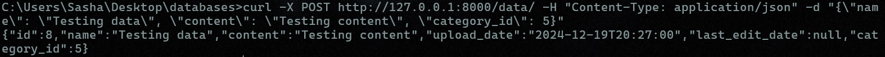
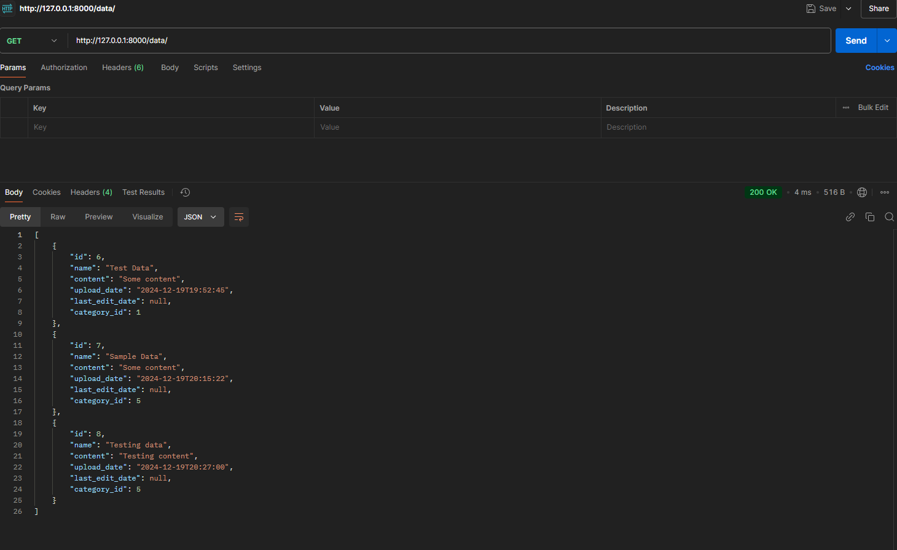
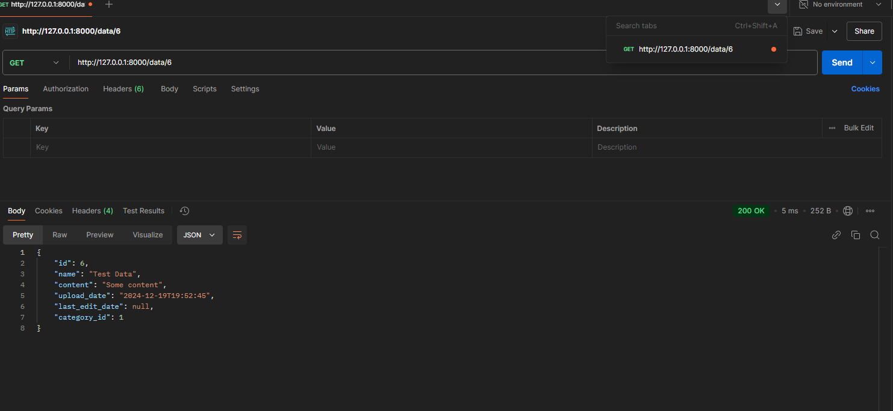
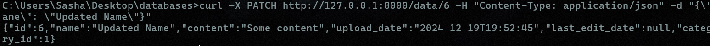
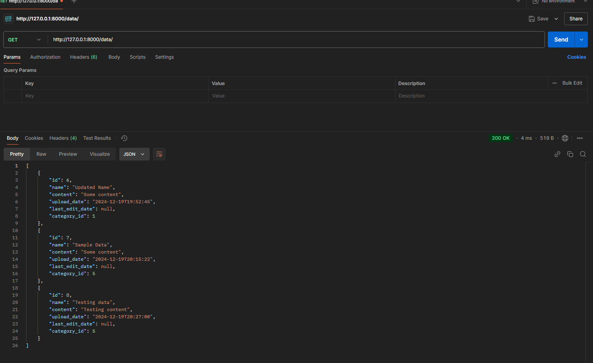
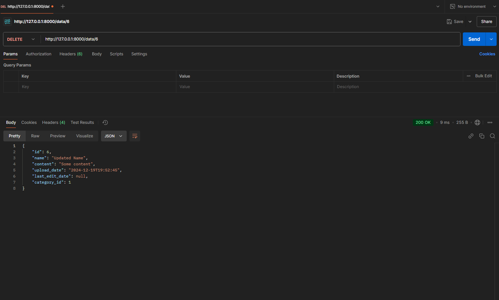
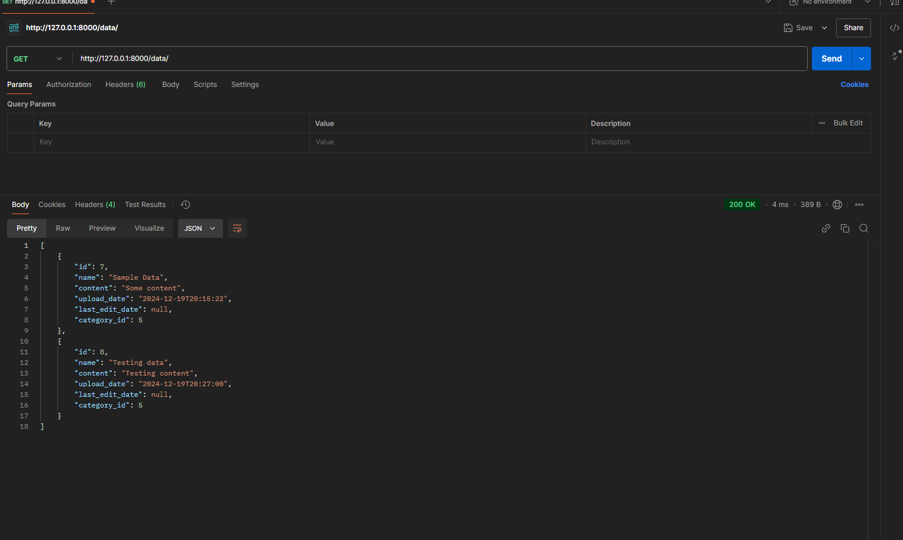

# Тестування працездатності системи

### POST
Post запит:

### GET

Get запит (без id)

Get запит (з id)

### PATCH

Patch запит

Get після patch

### DELETE 

Delete запит 

Get після delete
